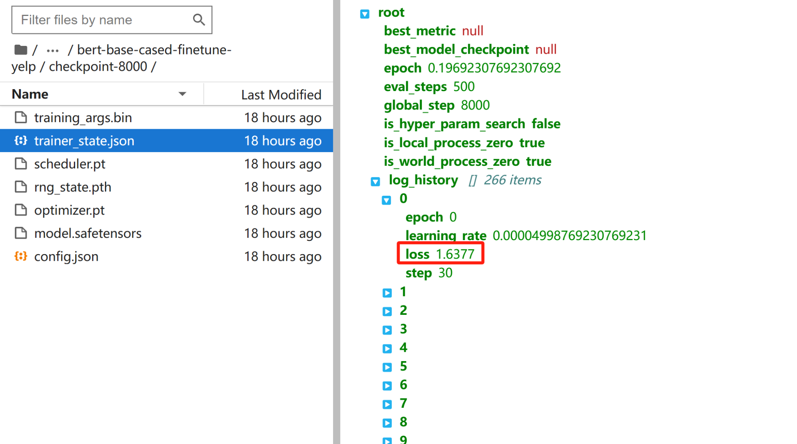
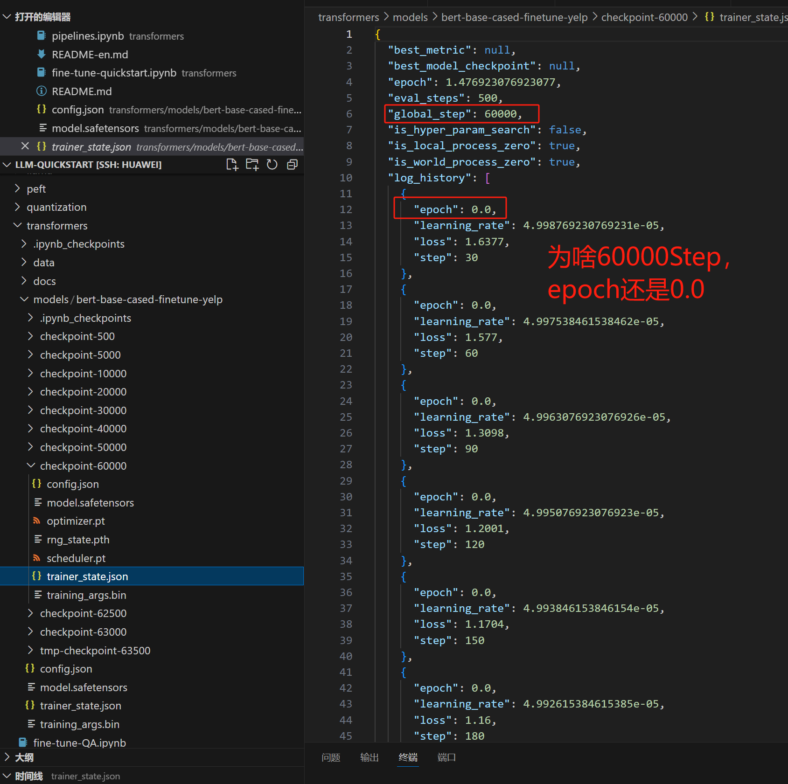
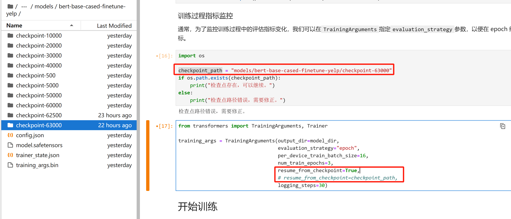
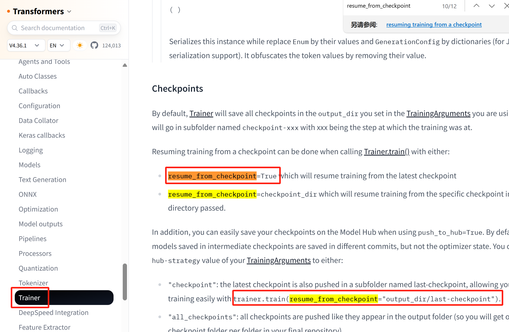
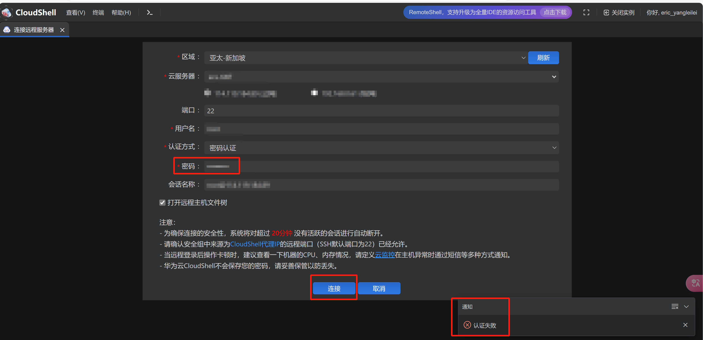
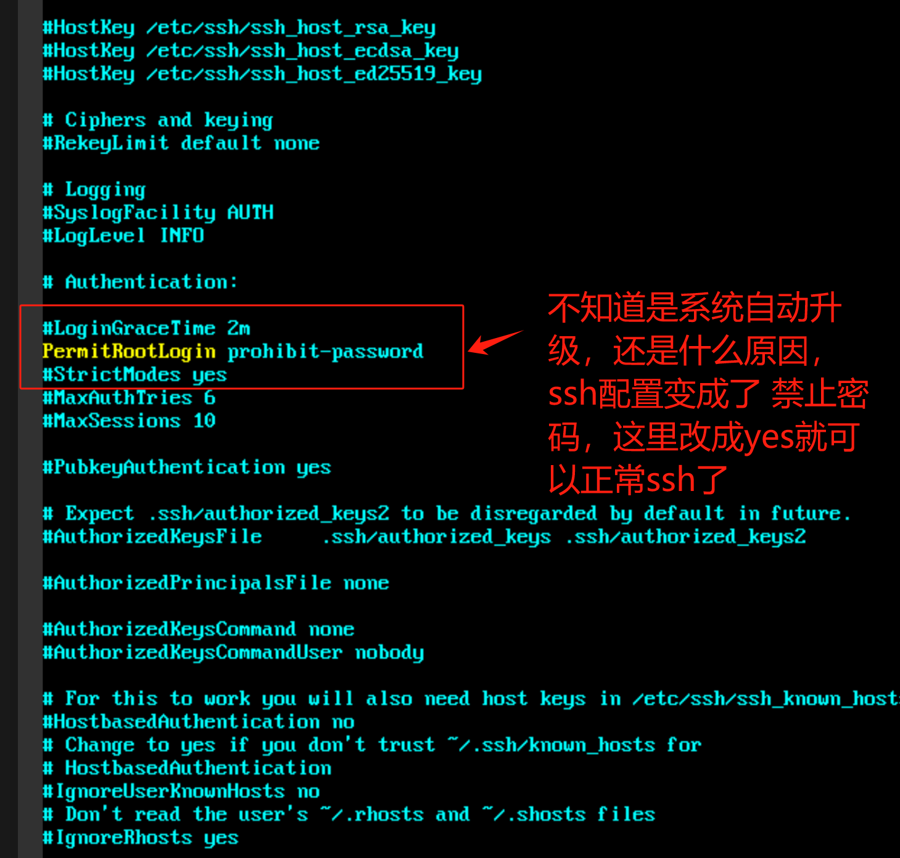

# 大模型微调训练 快速入门

<p align="center">
    <br> 中文 | <a href="README-en.md">English</a>
</p>


大语言模型快速入门（理论学习与微调实战）

## 拉取代码

你可以通过克隆此仓库到 GPU 服务器来开始学习：

```shell
git clone https://github.com/DjangoPeng/LLM-quickstart.git
```

## 搭建开发环境

本项目对于硬件有一定要求：GPU 显存不小于16GB，支持最低配置显卡型号为 NVIDIA Tesla T4。

建议使用 GPU 云服务器来进行模型训练和微调。

项目使用 Python 版本为 3.10，环境关键依赖的官方文档如下：

- Python 环境管理 [Miniconda](https://docs.conda.io/projects/miniconda/en/latest/)
- Python 交互式开发环境 [Jupyter Lab](https://jupyterlab.readthedocs.io/en/stable/getting_started/installation.html)


**以下是详细的安装指导（以 Ubuntu 22.04 操作系统为例）**：

### 安装 CUDA Toolkit 和 GPU 驱动

根据你的实际情况，找到对应的 [CUDA 12.04](https://developer.nvidia.com/cuda-downloads?target_os=Linux&target_arch=x86_64&Distribution=Ubuntu&target_version=22.04&target_type=runfile_local)：

下载并安装 CUDA 12.04 Toolkit（包含GPU驱动）：

```shell
wget https://developer.download.nvidia.com/compute/cuda/12.4.0/local_installers/cuda_12.4.0_550.54.14_linux.run
sudo sh cuda_12.4.0_550.54.14_linux.run
```

**注意使用`runfile`方式，可以连同版本匹配的 GPU 驱动一起安装好。


安装完成后，使用 `nvidia-smi` 指令查看版本：

```shell
nvidia-smi    
为了实时查看GPU使用情况，可以使用 watch 指令实现轮询：watch -n 1 nvidia-smi:

Mon Dec 18 12:10:47 2023       
+---------------------------------------------------------------------------------------+
| NVIDIA-SMI 535.129.03             Driver Version: 535.129.03   CUDA Version: 12.2     |
|-----------------------------------------+----------------------+----------------------+
| GPU  Name                 Persistence-M | Bus-Id        Disp.A | Volatile Uncorr. ECC |
| Fan  Temp   Perf          Pwr:Usage/Cap |         Memory-Usage | GPU-Util  Compute M. |
|                                         |                      |               MIG M. |
|=========================================+======================+======================|
|   0  Tesla T4                       Off | 00000000:00:0D.0 Off |                    0 |
| N/A   44C    P0              26W /  70W |      2MiB / 15360MiB |      6%      Default |
|                                         |                      |                  N/A |
+-----------------------------------------+----------------------+----------------------+
                                                                                         
+---------------------------------------------------------------------------------------+
| Processes:                                                                            |
|  GPU   GI   CI        PID   Type   Process name                            GPU Memory |
|        ID   ID                                                             Usage      |
|=======================================================================================|
|  No running processes found                                                           |
+---------------------------------------------------------------------------------------+
```

### 安装操作系统级软件依赖

```shell
sudo apt update && sudo apt upgrade
sudo apt install ffmpeg
## 检查是否安装成功
ffmpeg -version
```

参考：[音频工具包 ffmpeg 官方安装文档](https://phoenixnap.com/kb/install-ffmpeg-ubuntu)


### 安装 Python 环境管理工具 Miniconda

```shell
mkdir -p ~/miniconda3
wget https://repo.anaconda.com/miniconda/Miniconda3-latest-Linux-x86_64.sh -O ~/miniconda3/miniconda.sh
bash ~/miniconda3/miniconda.sh -b -u -p ~/miniconda3
rm -rf ~/miniconda3/miniconda.sh
```

安装完成后，建议新建一个 Python 虚拟环境，命名为 `peft`。

```shell
conda create -n peft python=3.10

# 激活环境
conda activate peft 
```

之后每次使用需要激活此环境。


### 安装 Python 依赖软件包

完整 Python 依赖软件包见[requirements.txt](requirements.txt)。

```shell
pip install -r requirements.txt
```


### 安装和配置 Jupyter Lab

上述开发环境安装完成后，使用 Miniconda 安装 Jupyter Lab：

```shell
conda install -c conda-forge jupyterlab
```

使用 Jupyter Lab 开发的最佳实践是后台常驻，下面是相关配置（以 root 用户为例）：

```shell
# 生成 Jupyter Lab 配置文件，
jupyter lab --generate-config
```

打开上面执行输出的`jupyter_lab_config.py`配置文件后，修改以下配置项：

```python
c.ServerApp.allow_root = True # 非 root 用户启动，无需修改
c.ServerApp.ip = '*'
```

使用 nohup 后台启动 Jupyter Lab
```shell
nohup jupyter lab --port=8000 --NotebookApp.token='替换为你的密码' --notebook-dir=./ &
```

Jupyter Lab 输出的日志将会保存在 `nohup.out` 文件（已在 .gitignore中过滤）。


### 关于 LangChain 调用 OpenAI GPT API 的配置

为了使用OpenAI API，你需要从OpenAI控制台获取一个API密钥。一旦你有了密钥，你可以将其设置为环境变量：

对于基于Unix的系统（如Ubuntu或MacOS），你可以在终端中运行以下命令：

```bash
export OPENAI_API_KEY='你的-api-key'
```

对于Windows，你可以在命令提示符中使用以下命令：

```bash
set OPENAI_API_KEY=你的-api-key
```

请确保将`'你的-api-key'`替换为你的实际OpenAI API密钥。

## 常用命令
```bash
# 为了实时查看GPU使用情况，可以使用 watch 指令实现轮询：
watch -n 1 nvidia-smi
```

```bash
# 检查端口使用
lsof -i :8000
```

```bash
# 检查硬盘使用
df -h
```

```bash
# 检查cpu/内存等状态
top
```

```bash
# 尝试加上-vvv参数以获得详细的调试信息
ssh -vvv root@xxx.xxx.xxx.xxx
```

```bash
# 使用telnet命令
telnet 目标IP地址 22
```

```bash
# 检查jupyter进程信息
ps -aux | grep jupyter | grep -v grep
```

```bash
# 检查SSH服务状态
sudo systes sshdmctl statu
```

```bash
# 判断22端口有没有开
netstat -tuln | grep 22
```

```bash
# 使用以下命令来设置用户名和邮箱：
设置用户名: git config --global user.name "你的用户名"
设置邮箱: git config --global user.email "你的邮箱地址"
```
## 问题：
### 问题1：
#### 问题描述：
我发现一个奇怪现象，所有的checkpoint，他内部记录的log_history都是从 loss=1.6377开始的，怎么理解这种现象

，我跑的是全量的YelpReviewFull

为什么6Wstep epoch还是0.0啊
#### 解答：
原因是，log_history是全量日志，每个checkpoint都会记录当前的全量日志

### 问题1：
#### 问题描述：
我试了两种方式，都不能从检查点恢复，run起来的时候都是从step1开始的


#### 解答：
```python
# 从最近的checkpoint恢复
trainer.train(resume_from_checkpoint=True)
# 从指定的checkpoint恢复
trainer.train(resume_from_checkpoint="models/bert-base-cased-finetune-yelp/checkpoint-63000")
```
resume_from_checkpoint是trainer的参数，不是TrainingArguments的参数


### 问题1：ssh登录失败
#### 问题描述
很奇怪啊，我的华为云ssh突然失败了，修改了新密码也登录不了

用vnc方式可以登录，ssh不行（本来是可以的）
#### 解决办法：
```bash
# 检查ssh配置
sudo vi /etc/ssh/sshd_config
```

不知道是系统自动升级，还是什么原因ssh配置变成了 禁止密码，PermitRootLogin prohibit-password改成PermitRootLogin True就可以正常ssh了
```bash
# 检查端口使用
sudo systemctl restart sshd
```
怀疑是华为云管理器，会在某个行为下，会自动禁用密码，

```bash
# 检查端口使用
lsof -i :8000
```

```bash
# 检查端口使用
lsof -i :8000
```

```bash
# 检查端口使用
lsof -i :8000
```